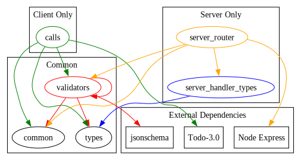

<!-- File auto-generated from README-template.md, using ./render-readme.sh. Local changes WILL be overwritten -->
YAPIgen
=======

Yet Another (Open)API generator, targeting TypeScript on both client and
server.

    -   [Usage](#usage)
        -   [Generated Code](#generated-code)
    -   [Configuration](#configuration)
        -   [Command Line Arguments](#command-line-arguments)
        -   [Configuration File Format](#configuration-file-format)
    -   [String Formats](#string-formats)
    -   [Supported Extensions](#supported-extensions)
        -   [x-isFlag](#x-isflag)
    -   [Deviations from the Standard](#deviations-from-the-standard)
        -   [Content-Type handling](#content-type-handling)
    -   [Known Limitations and
        Problems](#known-limitations-and-problems)
        -   [Generated Error Responses from the
            Server](#generated-error-responses-from-the-server)
        -   [No support for multi-file
            schemas](#no-support-for-multi-file-schemas)
        -   [Handling of
            `additionalProperties`](#handling-of-additionalproperties)
        -   [Limited Handling of
            `securitySchema`](#limited-handling-of-securityschema)
        -   [Partial Generation](#partial-generation)
        -   [Alternative Content Types](#alternative-content-types)
    -   [Licensing](#licensing)
    -   [Development](#development)
        -   [Generated Source Files](#generated-source-files)
        -   [Testing](#testing)

[](https://nodei.co/npm/yapigen/)

Usage
-----

To get started, run with a [configuration file](#configuration-file-format).

    yapigen --config generator-config.yaml

For an sample configuration file, see the [test suite](./tests/run/config.yaml).

Many options are available both as command line arguments, and as configuration
file parameter. Options with "the same" name are the same.

**NOTE**: the given OpenAPI schema is expected to be well formed, and an
invalid schema will lead to undefined behaviour (and most likely weird
crashes). It's strongly recommended to first pass the schema through something
like [`openapi-generator validate`](https://github.com/openapitools/openapi-generator/)
or [`redocly lint`](https://github.com/Redocly/redoc).

### Generated Code
This generator produces a number of files, with code for both a client and a
server. Within the generated modules, there are some internal dependencies, as
well as some external dependencies which require the codebase receiving the
generated code to provide. The figure below gives a general idea of how all
files generate<sup id="return1">[1](#footnote1)</sup>.

The general philosophy of the generated code is to provide a clean interface
for the application program to build upon, while the generated files should
never be touched by the programmer.

Data provided by the program is assumed well formed (and therefore only checked
by the TypeScript type system), while data recieved over the is untrusted, and
will be carefully validated, before being passed to the user (of the generated
code), along with a proper TypeScript signature.

As per the image, both the client and server code must be able to access the
common code, but they doesn't have to be able to access each other.



#### Assumptions for Generated Code

##### All Code
Both the client and server requires
[jsonschema](https://github.com/tdegrunt/jsonschema#readme) to be present.
The library is used to validate received content over the network.

##### Client Code
The client makes all authenticated requests through the
[`request` interface provided by Todo 3.0](https://npmjs.com/package/@todo-3.0/request).

###### Error Handling
The generated API wrappers will return an object to the caller if
everything went as expected, meaning any response noted in the OpenAPI
specification (including bad responses), or if a "recoverable" error
was found.  Recoverable errors includes: failure to authenticate,
authentication canceled, and network errors. In all other cases, the
procedure throws `APIMalformedError`, containing a human readable text
noting what went wrong.

The idea of splitting errors between the return channel and the error
channel is to differentiate between "recoverable" and "irrecoverable"
errors. For example, if the server returns unexpected data, then it's
better to fail fast than to work on the (possibly) invalid data, which
could lead to much bigger problems down the line, and instead prompt
the user to check the version and configuration of both the server and
client.

The calls will throw in the following situations:
- An authentication call was "malformed"
- Required response headers are missing
- Response body is of unknown content type
- Response body is malformed<sup id="return2">[2](#footnote2)</sup>
- Unknown response status code

If the user code can't gracefully handle a given response (for example,
a 400 or 5xx response), it may manually import `APIMalformedError`
from the generated [`common`](#common) file. The reason these
responses don't automatically throw is to account for cases to complex
for OpenAPI to handle, such as two mutually exclusive query parameters.

##### Server Code

The server expects [Node Express](https://expressjs.com/). Porting this to a
different server implementation shouldn't be to hard. Pull requests welcome :).

All content encoding and decoding is handled by the generated code. This means
that the generated router will contain
`router.use(express.raw(({ type: '*/*' })))`.
This **must not** be overwritten by another rule on the application, and
**will** lead to runtime errors.

If cookies are used in requests, then
[cookie-parser](https://www.npmjs.com/package/cookie-parser) must be manually
installed and configured on the app.


#### Generated Files

This are the exact list of files which are generated, and what each one
contains.

##### calls
Contains a list of functions for issuing API requests to the server.
This is the main interface for client programs. However, they are still
encouraged to wrap these calls in a nicer interface matching the actual code
base.

Makes heavy use of the `request` library from Todo 3.0 for authenticated requests.

##### common
Common utility functions and types.

##### server_handler_types
Types for each handler, as should be provided to `setup_router` from
"server_router". The user written server code should generally import these in
order to properly implement endpoint handlers. For example, for the example
endpoint `/get-users`:

```typescript
import type * as types from '<server-handler-types>'

const handle_getUsers: types.getUsers = async () => {
    return {
        status: 200,
        'application/json': () => [/* user list would have gone here */],
    }
}
```

##### server_router
Setup code for an express router. Exports the function `setup_router`, which
takes a structure specifying handlers for every configured endpoint. For most
clients, this module should be imported, and installed on the express app as
follows:

```typescript
app.use('/', setup_router(/* handlers here */))
```

Handlers for each endpoint *must* be provided by the programmer.

##### types
Type declarations for all objects which might be sent over the network.

##### validators
Functions checking if object received over the network are on the expected
form. Generally, these expect JavaScript objects received from successful calls
to `JSON.parse`

Configuration
-------------

### Command Line Arguments
Command line arguments are parsed in an additive manner, meaning that all
arguments can appear multiple times, and it's the last writer of an option
which "wins". This includes configuration files, which simply adds their
content to the current "config set".

- `--conf-format <"yaml" | "json">`, for the next `--config` command, don't try
  to infer file type form extension, but force the one given. Note that this
  only applies to *one* `--config` option, meaning that the second `--config`
  after this reverts to automatic file type detection.
- `--config <path>`, load the configuration file at path. Tries to guess file
  type from extension, unless `--conf-format` has been given beforehand.
  JSON files (with `.json` extension), and YAML files (with `.yaml` or `.yml`
  extension) are supported.
- `--include-source-locations ["raw"]` enabled comments noting the
  source code location in the generator for each generated code
  fragment. This is only really to debug the generator.
  By default, the generator files are checked for source maps. If you
  however want the location in the actual file ran, pass `raw` as an argument.
- `--input <openapi-file>`,
  OpenAPI file to use as input.
- `--no-prettier`, don't run [prettier][prettier] on the generated code.
- `--output-<file> <path>`, set destination path for specific file. `<file>` is
  one of the files [specified above](#generated-files), with the semantics of
  [`configuration.output`](#output) when `libname` is unspecified.
- `--gensym-seed <n>,<n>,<n>,<n>`, sets the seed used when generating symbols
  for the resulting code.

### Configuration File Format

Besides this documentation, see the
[full JSON Schema for the configuration in the source](./src/configuration.ts).

All file paths are resolved relative to the configuration file.

Currently, the configuration file *must* me in YAML format (remember; JSON
files are valid YAML).

#### `include_source_locations`
*type*: boolean, *default*: false

Should the location in the generators source code where each code fragment
originated be added as comments to the output?

#### `input`
*type*: file path, *required*

Path to OpenAPI file to generate code from.

#### `output`
*required*

Object denoting where each generated file ends up, and optionally how it can be
imported by all other generated code.

This is an object where the keys are the file "names", as declared
[above](#generated-files), and the values being objects containing the
parameters
- `path`, which indicates where the file should end up, and
- `libname`, which (when present) specifies the string the generated module can
  be imported with by other generated code. If not present, imports will be
  relative paths between the "other" module and "this" module. This will
  usually work, unless different generated modules are placed in different
  modules.

#### `prettify`
*type*: boolean, *default*: true

Should [prettify][prettify] be ran on the generated code before writing
it out?

#### `gensym-seed`
Seed for symbol generator. Takes an array of 4 32-bit integers (meaning that
more significant bits than that will most likely be removed. Integers in
Javascript are weird).

#### `standalone`
Set of extra files to generate, which allows generation of a
standalone project. Mostly used for simple tests, or as a jump-off
point for new projects.

Takes the following keywords, which each specify the target filename.

- `eslint` - eslint configuration.
- `package` - package.json. Also acts as reference for runtime dependencies.
- `tsconfig` - tsconfig, allows project to build by itself.


#### `string_formats`
Extra [string formats](#string-formats). A mapping from names to format
specifiers, where each specifier is an object with the following parameters:

<!-- TODO this section needs to be cleaned up.
Note however that these parameters WILL change once string formats are better
specified, see below.
-->

- `parse`, a function specifier taking a string, and returning a parsed value.
- `serialize`, a function specifier taking a parsed value, and returning a string.
- `instanceof`, (optional) function specifier checking if a parsed value is of
  this type. Defaults to `value instanceof ${type}`
- `type`, TypeScript type returned by `parse`
- `imports`, set of items which need to be imported for the other fields to work.
  Is a record from import paths, to list of symbols to import from that path.

Multiple of the entries take "function specifier"s. These are object which will
be evaluated to functions during runtime. They have 2 parameters:
- `param`, name of the input parameter to the function
- `body` function body,

An example

```yaml
string-formats:
  'X-Todo-3.0-Entry-Id':
    parse: { param: x, body: 'parseEntryId(${x})' }
    serialize: { param: x, body: 'entryIdToString(${x})' }
    instanceof: { param: x, body: 'typeof ${x} === "string"' }
    type: 'EntryId /* test */'
    imports:
      '@todo-3.0/common/types':
        - EntryId
        - parseEntryId
        - entryIdToString
```

String Formats
--------------
JSON Schema (and therefore OpenAPI by extension) allows strings to have a
well-specified format, such as an ipv6 address or a date-time.

**TODO** these are under-specified currently, see issues:
- https://github.com/HugoNikanor/yapigen/issues/1
- https://github.com/HugoNikanor/yapigen/issues/2

See also:
- https://spec.openapis.org/registry/format/
- [Configuration of Custom Formats](#string_formats)

Supported Extensions
--------------------

### x-isFlag
For query parameters, the `x-isFlag` property is supported. If set to true,
then the parameter will only be included when true (with an unspecified
payload), and omitted completely while absent.

This is based on the [description by Rinzwind](https://github.com/OAI/OpenAPI-Specification/issues/1782#issuecomment-449357547).

> Default value is `false`. The value `true` is only valid if `in` is `query`,
> `required` is `false`, `allowEmptyValue` is `true`, and `schema` is omitted.
> The parameter can optionally be appended to the URL, but should not be
> followed by a value assignment.

Deviations from the Standard
----------------------------

### Content-Type handling
OpenAPI specifies that content type matches are *exact*, meaning that
`text/plain` and `text/plain; encoding=utf8` are treated as completely separate
content types. The generated instead treats both of these as `text/plain`, and
handles encoding (and other relevant parameters) beforehand. API's where
actually different content types are added by parameters in the header are
**not** supported (just use an actually different content type).

Known Limitations and Problems
------------------------------

### Generated Error Responses from the Server
The error responses for missing and invalid parameter responses in the
generated server code are hard coded, meaning that they most likely won't match
the supplied schema.

### No support for multi-file schemas
Only OpenAPI schemas contained in a single file are supported.

### Handling of `additionalProperties`
Currently, the parameter `additionalProperties` is ignored, and the code mostly
works as if it's false (except in some cases).

Same goes for pattern properties.

### Limited Handling of `securitySchema`
Client side, api calls are simply grouped into authorized and non-authorized
functions, with all authorized functions assuming JWT authorization as per
Todo-3.0's request system.

Server side, no authentication checks are done, and no information about public
or private endpoints and resources are passed along to the handlers. This means
that the programmer must handle that some other way.

### Partial Generation
Currently, all components are always generated. However, there should be
options to only generate a client, or only a server. This should preferably
come from making fields in `configuration.output` optional, along with a proper
dependency setup ensuring that all supporting files are also generated.

### Alternative Content Types
The generated client code sets no `Accept` header, defaulting to `*/*`. This
should maybe be changed to only accept the declared response types in the API,
or the subset of those that the generated code actually handles.
Note that the code for handling the response from the server still checks the
declared content types.

Licensing
---------
The source code is licensed under [Apache 2.0](./LICENSE). Since parts of the
output are fragments of this programs source, then the generated code will
probably be licensed under Apache 2.0. Either way, the goal is that all code
generated by this program should not have any licensing restrictions imparted
to it by this program, and should solely inherit the license of the OpenAPI
spec used as input. If you happen to be a lawyer, please help ensure that's
actually the case.

Development
-----------

Before commiting, remember to render this README, by calling
`npm run render-readme`.

### Generated Source Files

The file [`src/openapi.d.ts`](./src/openapi.d.ts) is auto-generated from the
JSON Schema for OpenAPI 3.0 2024-10-18 (latest 3.0 version choosen over 3.1,
since 3.1 version didn't work with `json-schema-to-typescript`), and then with
a few manual patches applied to the generated output.

To generate it, run

```sh
filename=openapi-schema-3.0-2024-10-18.json
curl -o "$filename" https://spec.openapis.org/oas/3.0/schema/2024-10-18
npm exec json2ts "$filename" > src/openapi.d.ts
git apply openapi.d.ts.patch
```

Note that the file is separately licensed under Apache-2.0, as a derived work
of the [OpenAPI 3.0.4 schema](https://spec.openapis.org/oas/v3.0.4.html#openapi-specification).

### Testing

This code base is tested in in two parts.

#### Unit tests

    npm run test

#### Generator Tests

    npm run coverage

Runs the application against a number of schema files.
This should result in 100% coverage of everything under the `formatters`
directory, as well as the json schema handling code. It does not need to cover
100% of cases in "general" libraries.

In the future, this the generated code should also be passed though a number of
linters and compilers, to ensure it's well formed.

--------------------------------------------------------------------------------

**Footnotes**

<a name="footnote1">1</a>: Note that the image isn't automatically generated
from the source code, and may therefore be out of date. [⮌](#return1)

<a name="footnote2">2</a>: If any strings with `format` specifiers are
present, exact behavior is still unspecified. [⮌](#return2)

[prettier]: https://prettier.io
<!--
Local Variables:
eval: (read-only-mode)
End:
vim:ro
-->
